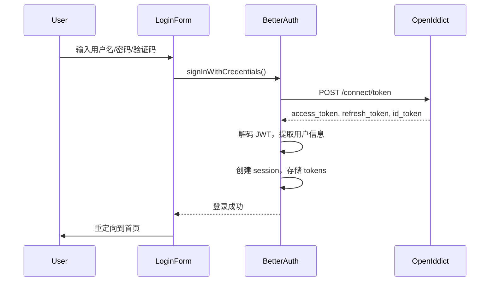
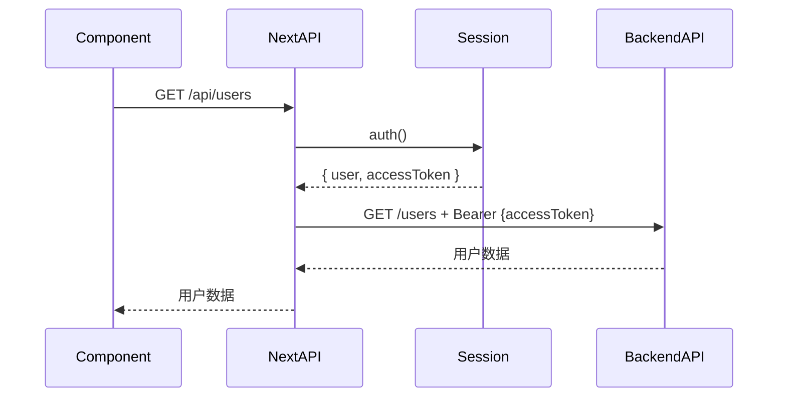

# Better-auth 集成指南

## 概述

本项目使用 **better-auth** 与后端 ASP.NET Core + OpenIddict 集成，实现完整的身份验证功能。

## 功能特性

### ✅ 已实现功能

1. **凭据登录（Credentials Login）**
   - 用户名/密码登录
   - 图形验证码支持
   - 与 OpenIddict `/connect/token` 端点集成

2. **Session 管理**
   - 使用 better-auth 的 cookieCache 实现无状态 session
   - Session 数据存储在 cookie 中（JWE 加密）
   - 7天缓存时长

3. **Token 管理**
   - accessToken：用于 API 请求授权
   - refreshToken：用于刷新访问令牌
   - idToken：OpenID Connect ID 令牌
   - 所有 token 存储在 session 中

4. **用户信息**
   - 基本信息：id, name, username, email
   - 角色信息：roles
   - 组织信息：organization_unit_code, organization_unit_id
   - 供应商信息：supplier_id

## 架构设计

### 文件结构

```
lib/
├── auth.ts              # better-auth 服务端配置
├── auth-client.ts       # 客户端 hooks 和工具函数
└── auth-server.ts       # 服务端 session 获取函数

app/api/auth/
└── [...all]/route.ts    # better-auth API 路由处理器

contexts/
└── auth-context.tsx     # React Context 提供权限管理

types/
└── auth-types.ts        # 类型定义
```

### 认证流程

#### 1. 登录流程



#### 2. API 请求流程



## 配置说明

### 环境变量

创建 `.env.local` 文件（参考 `.env.example`）：

```env
# OpenIddict 服务器配置
OPENIDDICT_INTERNAL_ISSUER=http://localhost:44322
OPENIDDICT_EXTERNAL_ISSUER=http://localhost:44322
OPENIDDICT_WELL_KNOWN=http://localhost:44322/.well-known/openid-configuration

# 客户端配置
NEXTAUTH_CLIENT_ID=YourClientId
NEXTAUTH_CLIENT_SECRET=YourClientSecret
NEXTAUTH_SCOPE='openid profile email offline_access YourScope'

# 应用配置
NEXT_PUBLIC_API_URL=http://localhost:44322
NEXT_PUBLIC_APP_URL=http://localhost:4201
```

### Better-auth 配置 (lib/auth.ts)

```typescript
export const auth = betterAuth({
  session: {
    cookieCache: {
      enabled: true,
      maxAge: 7 * 24 * 60 * 60, // 7 天
      strategy: "jwe", // JWE 加密
      refreshCache: true,
    },
    additionalFields: {
      accessToken: { type: "string", required: false },
      refreshToken: { type: "string", required: false },
      idToken: { type: "string", required: false },
    },
  },
  plugins: [
    customSession(async (sessionData, ctx) => {
      // 从 account 中提取 tokens 并添加到 session
      const accounts = await ctx.context.internalAdapter.findAccounts(sessionData.user.id);
      const account = accounts?.[0];
      return {
        ...sessionData.session,
        accessToken: account?.accessToken,
        refreshToken: account?.refreshToken,
        idToken: account?.idToken,
      };
    }),
    credentials({
      autoSignUp: true,
      path: "/sign-in/credentials",
      async callback(ctx, parsed) {
        // 调用 OpenIddict token 端点
        const response = await fetch(
          `${process.env.OPENIDDICT_INTERNAL_ISSUER}/connect/token`,
          {
            method: "POST",
            headers: { "Content-Type": "application/x-www-form-urlencoded" },
            body: new URLSearchParams({
              grant_type: "password",
              client_id: process.env.NEXTAUTH_CLIENT_ID,
              username: parsed.username,
              password: parsed.password,
              captchaid: parsed.captchaid,
              captchacode: parsed.captchacode,
              scope: process.env.NEXTAUTH_SCOPE,
            }),
          }
        );
        
        const data = await response.json();
        const decodedJWT = jwtDecode(data.access_token);
        
        return {
          email: decodedJWT.email,
          name: decodedJWT.preferred_username,
          username: decodedJWT.preferred_username,
          roles: decodedJWT.role,
          // ... 其他字段
          onLinkAccount(user) {
            return {
              accessToken: data.access_token,
              refreshToken: data.refresh_token,
              idToken: data.id_token,
            };
          },
        };
      },
    }),
  ],
});
```

## 使用方法

### 客户端组件

```typescript
import { useSession, signOut } from "@/lib/auth-client";

export function MyComponent() {
  const { data: sessionData, isPending } = useSession();
  
  if (isPending) return <div>加载中...</div>;
  
  if (!sessionData?.user) {
    return <div>未登录</div>;
  }
  
  return (
    <div>
      <p>欢迎, {sessionData.user.name}</p>
      <p>角色: {sessionData.user.roles}</p>
      <button onClick={() => signOut()}>退出</button>
    </div>
  );
}
```

### 服务端组件

```typescript
import { auth } from "@/lib/auth-server";

export default async function MyPage() {
  const session = await auth();
  
  if (!session) {
    redirect("/account/login");
  }
  
  return (
    <div>
      <p>用户名: {session.user.username}</p>
      <p>组织: {session.user.organization_unit_code}</p>
    </div>
  );
}
```

### API 路由

```typescript
import { auth } from "@/lib/auth-server";

export async function GET(request: NextRequest) {
  const session = await auth();
  
  if (!session) {
    return NextResponse.json({ error: "Unauthorized" }, { status: 401 });
  }
  
  // 使用 accessToken 调用后端 API
  const response = await fetch(`${API_URL}/data`, {
    headers: {
      Authorization: `Bearer ${session.accessToken}`,
    },
  });
  
  return response;
}
```

### 登录表单

```typescript
import { signInWithCredentials } from "@/lib/auth-client";

const onSubmit = async (data) => {
  const result = await signInWithCredentials({
    username: data.username,
    password: data.password,
    captchaid: data.captchaid,
    captchacode: data.captchacode,
  });
  
  if (result.error) {
    // 处理错误
    console.error(result.error);
  } else {
    // 登录成功，会自动重定向到首页
  }
};
```

## Session 数据结构

```typescript
interface Session {
  user: {
    id: string;
    name: string;
    username: string;
    email: string;
    roles: string | string[];
    organization_unit_code?: string;
    organization_unit_id?: string;
    supplier_id?: string;
  };
  accessToken?: string;
  refreshToken?: string;
  idToken?: string;
  expiresAt?: number;
}
```

## 权限管理

使用 `AuthContext` 进行权限检查：

```typescript
import { useAuth } from "@/contexts/auth-context";

export function MyComponent() {
  const { hasPermission, hasAnyPermission } = useAuth();
  
  if (!hasPermission("Users.Create")) {
    return <div>无权限</div>;
  }
  
  return <button>创建用户</button>;
}
```

## Cookie 设置

Better-auth 自动管理以下 cookies：

1. **better-auth.session_token** - Session token (HttpOnly, Secure)
   - 存储加密的 session 数据
   - 包含用户信息和 tokens
   - 7天过期时间

2. **better-auth.session_data** - Session data cache
   - 缓存 session 数据以提高性能
   - 客户端可读（用于 React hooks）

## 安全考虑

1. **Token 加密**: Session tokens 使用 JWE 加密存储在 cookie 中
2. **HttpOnly Cookies**: 生产环境启用 HttpOnly 和 Secure 标志
3. **CSRF 保护**: Better-auth 内置 CSRF 保护
4. **Token 刷新**: 支持使用 refreshToken 自动刷新访问令牌
5. **验证码**: 登录时强制使用图形验证码

## 故障排查

### 问题：登录后无法获取 token

**解决方案**: 检查 customSession 插件是否正确配置，确保 tokens 从 account 复制到 session。

### 问题：API 请求返回 401

**解决方案**: 
1. 检查 session 中是否包含 accessToken
2. 验证 Authorization header 格式正确
3. 检查 token 是否过期

### 问题：用户信息丢失

**解决方案**: 确保在 credentials callback 的 onSignIn 中正确返回所有用户字段。

## 后续优化

- [ ] 实现自动 token 刷新机制
- [ ] 添加 Redis 支持以实现跨服务器 session 共享
- [ ] 实现"记住我"功能（延长 session 时长）
- [ ] 添加双因素认证（2FA）支持
- [ ] 实现 SSO（单点登录）支持

## 参考资料

- [Better-auth 官方文档](https://www.better-auth.com/)
- [Better-auth Credentials Plugin](https://github.com/better-auth/better-auth-credentials-plugin)
- [OpenIddict 文档](https://documentation.openiddict.com/)
